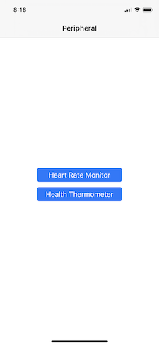
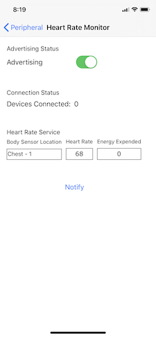
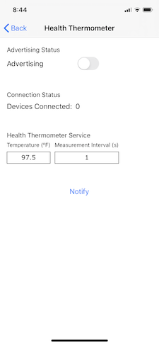

# BLE Peripheral Emulator

This iOS app emulates a Bluetooth peripheral device on any iOS device that has Bluetooth support. 
The emulator has support for three types of BLE device services; battery, heart rate and health thermometer.
The battery service is disabled because all iOS devices already advertise a battery service.

The main screen presents a set of buttons to the BLE device emulators. 
The emulator screens have a switch for enable/disable the BLE service.
A label that displays the number of BLE centrals connected to the device service.
Parameters that can be set for each device service. 
A button to send a notification to subscribed central devices.

The Heart Rate service supports a heart rate, body sensor location and energy expanded value.
The Health Thermometer service supports a temperature and measurement interval value.

 
